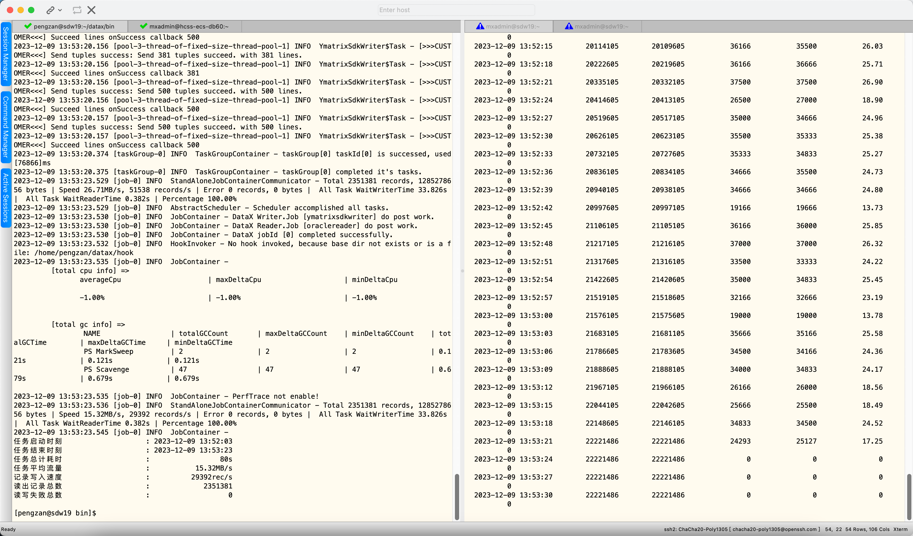

# DataX ymatrixsdkwriter

- MxGate API服务配置文件示例
```bash
mxgate config \
    --source http \
    --db-database postgres \
    --target public.gl_voucher \
    --time-format raw \
    --grpc-port 8087 \
    --format csv \
    > mxgate_http.conf
```

- 启动MxGate API服务
```bash
mxgate start --config mxgate_http.conf
```
---


## 1 快速介绍

ymatrixsdkwriter插件实现了通过MxGate SDK写入数据到YMatrix的功能，并支持大部分特殊字符的写入及byte数据的转换写入


## 2 实现原理

通过HTTP或gRPC接口调用，传递数据至MxGate，MxGate服务再将数据写入YMatrix


## 3 功能说明

### 3.1 配置样例

* 这里使用一份从内存产生到 ymatirxsdkwriter导入的数据。

```json
{
  "job": {
    "setting": {
      "speed": {
        "byte": -1,
        "channel": "64"
      }
    },
    "content": [{
      "reader": {},
      "writer": {
        "name": "ymatrixsdkwriter",
        "parameter": {
          "cacheCapacity": "50000",
          "cacheEnqueueTimeout": "3000",
          "sdkConcurrency": "50",
          "requestTimeoutMillis": "500000",
          "maxRequestQueued": "100000",
          "maxRetryAttempts": "3",
          "retryWaitDurationMillis": "1000",
          "batchSize": "5000",
          "requestType": "http",
          "dropAll": "no_dropAll",
          "asyncMode": "no_async",
          "httpHost": "http://172.16.100.30:8086/",
          "gRPCHost": "172.16.100.30:8087",
          "schema": "public",
          "table": "gl_voucher",
          "compressWithZstd": "no_zstd"
        }
      }
    }]
  }
}

```

### 3.2 参数说明

* **cacheCapacity**

    * 描述：用于暂存 tuples 微批的 queue的大小<br />

    * 必选：是 <br />
    
    * 默认值：无 <br />


* **cacheEnqueueTimeout**

    * 描述：若queue满，tuples 存入 queue 的等待超时时间。若超时，会抛出IllegalStateException <br />

    * 必选：是 <br />

    * 默认值：无 <br />


* **sdkConcurrency**

    * 描述：同时向 mxgate 写入数据的线程数量，推荐调整为 10～100 的某个值 <br />

    * 必选：是 <br />

    * 默认值：无 <br />


* **requestTimeoutMillis**

    * 描述：每个线程每次数据写入请求的超时时间(毫秒)

    * 必选：是 <br />

    * 默认值：无 <br />


* **maxRequestQueued**

  * 描述：最大请求队列

  * 必选：是 <br />

  * 默认值：无 <br />

* **maxRetryAttempts**

  * 描述：每个线程每次写入请求遇到问题后的重试次数 <br />

  * 必选：是 <br />

  * 默认值：无 <br />


* **retryWaitDurationMillis**

  * 描述：每次重试的时间间隔（当前的实现，每次重试的时间间隔是固定的） <br />

  * 必选：是 <br />

  * 默认值：无 <br />


* **batchSize**

  * 描述：单批次发送的数据行数

  * 必选：是 <br />

  * 默认值：无 <br />


* **requestType**

  * 描述：接口请求类型 (http / grpc)

  * 必选：是 <br />

  * 默认值：无 <br />


* **dropAll **

  * 描述：用于测试，(dropAll / no_dropAll)，dropAll则不会发送数据给 mxgate，直接 drop <br />

  * 必选：是 <br />

  * 默认值：无 <br />


* **asyncMode**

  * 描述：发送数据方式 (sync / async) <br />

  * 必选：是 <br />

  * 默认值：无 <br />


* **httpHost**

  * 描述：MxGate HTTP接口地址

  * 必选：是 <br />

  * 默认值：无 <br />


* **gRPCHost**

  * 描述：MxGate gRPC接口地址

  * 必选：是 <br />

  * 默认值：无 <br />


* **schema**

  * 描述：目标表的SCHEMA <br />

  * 必选：是 <br />

  * 默认值：无 <br />


* **table**

  * 描述：目标表名

  * 必选：是 <br />

  * 默认值：无 <br />


* **compressWithZstd**

  * 描述：是否使用zstd压缩 (zstd / no_zstd)

  * 必选：是 <br />

  * 默认值：无 <br />


- 性能：吞吐量示例截图

63列，约235万行

